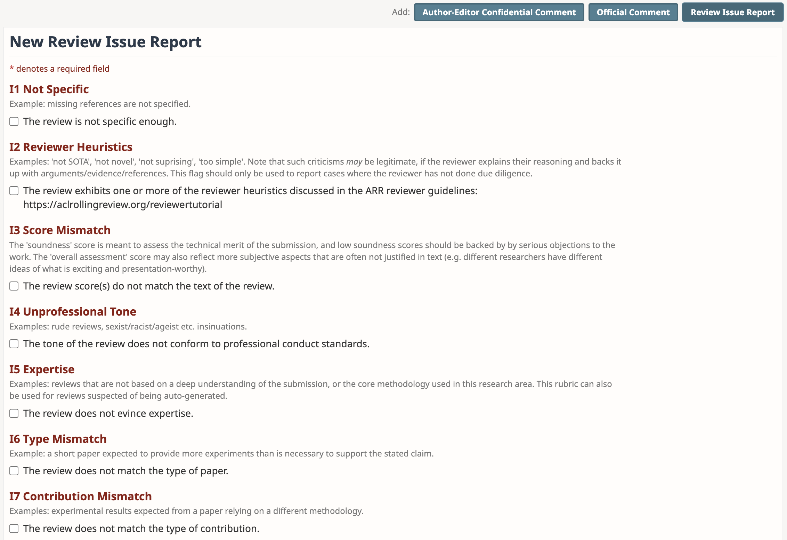
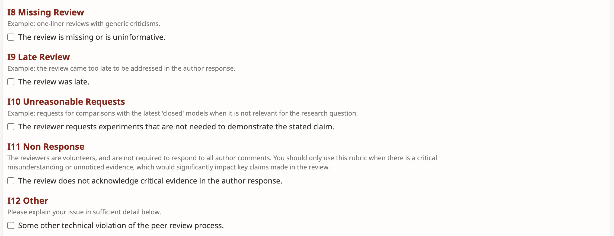
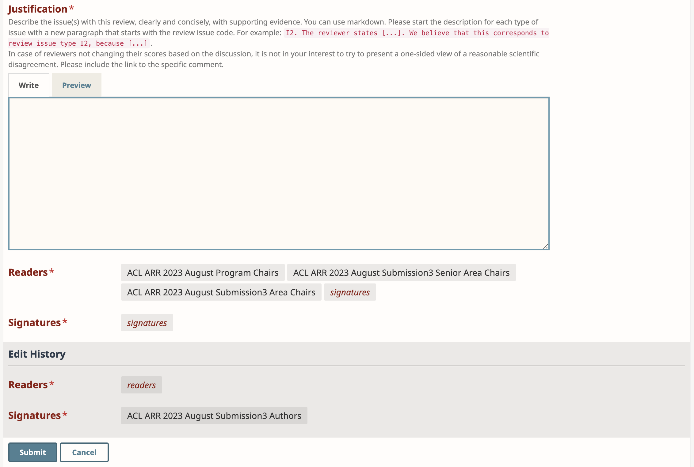

This page contains a step-by-step guide and FAQ for authors who wish to have their work reviewed by ARR. We have also created a detailed video presentation covering this information: <https://www.youtube.com/watch?v=DaoCLEghXyU> (latest updates not included).

# Step 0: Is ARR right for your paper? {#step0}

ARR provides reviews—and only reviews—for submissions. The reviews will not be specific to a conference/venue, but the standards expected by reviewers are those of a traditional direct submission as a long or short main conference paper to ACL (or the other major conferences operated by the ACL). Refer to the [the CFP](/cfp) for the scope and requirements to the submissions.

Some caveats:

- System demonstrations should NOT be submitted to ARR. Conferences typically have a separate review process for them with different policies (e.g., different paper lengths and single-blind submissions). If you do submit a paper to ARR that describes a system, it will be reviewed as a normal main conference paper and your reviews will only be eligible for commitment to venues listed on our venues page (which does not include system demonstration tracks at conferences).
- If you intend to send your paper to a workshop or to a more specialized conference like CoNLL, \*SEM, INLG, etc., check whether it is listed on [the venues page](/dates). If not, there may be venue-specific review processes.
- Some venues are hybrid, meaning they will consider ARR-reviewed papers as well as direct submissions.

# Step 1: Submit your paper for ARR review {#step1}

There is a submission **deadline** every two months: see [dates and venues](/dates). Deadlines are firm. You are encouraged to have a look at the [submission form](/submissionform) and [responsible NLP checklist](/responsibleNLPresearch.md), which list all the questions you will be asked during submission. To help the authors avoid desk rejection, we also prepared [a list of common problems to check](/authorchecklist.md).

The submission must adhere to the formatting in [the submission templates](https://acl-org.github.io/ACLPUB/formatting.html), which is available as an [Overleaf template](https://www.overleaf.com/latex/templates/association-for-computational-linguistics-acl-conference/jvxskxpnznfj).

Submissions are made in **OpenReview**. Here is the list of [submission points for 2024](https://openreview.net/group?id=aclweb.org/ACL/ARR/2024). In case of system instability it is recommended to submit at least one hour before the deadline. All authors will receive a confirmation email upon submission. You may **edit** all aspects of your submission up until the deadline.

At the time of submission you may opt to have ARR publish your paper as an **anonymous preprint**. These will remain anonymous during and after the review process. If you wish to remove an anonymous preprint, please contact the ARR editors (see [People](/people)). 

As soon as you have submitted your paper, it will be considered **under review** by ARR. You may not submit the paper elsewhere during this period.

 You may **withdraw** your submission during this period (before it receives a meta-review), but if you do so more than 48 hours after the submission deadline, your paper will be ineligible for resubmission in the next cycle. Contact the editors if you encounter special circumstances and are not sure whether withdrawal is appropriate. To withdraw, log into OpenReview, select your submission and then click on the “trash can” icon in the top right.

A submission may be **desk rejected** if it does not adhere to the [CFP](/cfp) (e.g. if it is not in scope, if it violates technical submission requirements, etc.) Sometimes a violation is not immediately obvious, but does get noticed later in the cycle. Due to that, desk rejection can occur at any point in the review cycle, even after receiving initial reviews or even a meta-review. If a technical violation is discovered, the paper can be submitted afresh in the next review cycle (the desk-rejected version does not count as a prior submission). To help the authors avoid desk rejections, we compiled [a list of common problems to check before submission](/authorchecklist.md).

# Step 2: Respond to reviews  {#step2}

## Author response {#step2.1}

Once the main reviews are available you will have an opportunity to submit an [**author response**](https://docs.google.com/document/d/1hPw4AVEWWL0SrHaqxiRcBO0pWCIWVrmWAYzeTwows4s/edit). This is not mandatory. This section describes the purpose of author response, it is up to you to decide whether it is beneficial in your case. The exact timing varies by cycle and is listed on [the dates and venues page](https://aclrollingreview.org/dates). 

The purpose of author response at ARR is different from that at conferences. At a conference, an author’s response is directly tied to an accept/reject decision, and therefore the authors often try to argue with the reviewers to accept their paper. On the other hand, ARR is only a reviewing platform and its reviewer do not have a direct say in the decision-making. Moreover, while conferences are a stateless system, in ARR, an author can always resubmit their paper in the next cycle after improving the paper and can request for the same or a different set of reviewers.

Due to these differences, the ARR author response also has different goals than a typical conference author response, and in some cases different workflows are more appropriate. Some examples follow:

- If a review raises criticisms that are based on minor misunderstandings or factual inaccuracies, the author response can and should focus on this. 
- If a reviewer makes significant clarity-related objections, it might be best to revise and resubmit (see [step 4](#step4)).
- If a reviewer has strong (and, in your opinion, unfair) objections about your paper, it might be prudent to resubmit and request a different set of reviewers in the next iteration. You will need to motivate this in the revision notes (see [step 4](#step4)). If you choose to try to convince them, you are welcome to cite [ARR reviewer guidelines](/reviewerguidelines.md). Now you also have [the option of reporting issues with reviews](#step2.2) after they are finalized.

Your response will immediately be visible to the reviewers. If a reviewer responds to your response, it will be possible to have a back-and-forth conversation using the ‘Official Comment’ button. Similar to the spirit of the first author response, the goal of the back-and-forth conversation is also to clarify any further misunderstandings; repeatedly arguing your point of view to a strongly opinionated reviewer will not be helpful and is not recommended. If you believe that the reviewer is violating the reviewer guidelines, it’s best to flag this using the confidential comment, specifying exactly what guideline is violated and why you believe so. Note that it is unreasonable to expect ACs to read very long discussions with reviewers: their guidelines ask them to read at least 2 author responses per review thread, but they will probably not read more. So please keep your discussion focused on the main issues that significantly impact the assessment.

All back-and-forth comments can be made until a final deadline, after which the area chairs will write their meta-review. The meta-review will be written taking your response and subsequent discussion (if any) into account. Your paper’s review is considered complete as soon as you receive the meta-review, and you are free to commit it to a venue that accepts ARR reviews, submit it to some other venue, or resubmit it to ARR in the next cycle.

**Q: Can I report new experimental results in a response?** For ARR, it is OK to present new experimental results that are in direct response to a reviewer’s question – these experiments should be minor add-ons to existing experiments, such as a new ablation, or a different hyperparameter setting, or a comparison with a different baseline. However, you are not allowed to submit unsolicited new results or fresh results that would indicate substantial additional work after the paper submission (e.g., results of new improved models).

**Q: Can I include links or images?** Your response must be text-only, and no external links are allowed. The paper will be desk-rejected if this is violated.

**Q: What if I respond to a reviewer’s concerns with a clarification and they don’t acknowledge it?** The reviewers are volunteers, and do not always respond. If they don’t, you can now [flag this in the review issue report](#step2.2).

**Q: Is it a good idea to press reviewers to raise their scores if I believe my response addressed their concerns? If they don’t, is that grounds for a confidential comment to the AC?** You can ask politely to change the evaluation if your response addressed the reviewer’s concern, but pressing them is probably not a good idea. Also, the reviewer may simply not be convinced by your arguments, and hence no, it’s not automatically grounds for flagging the issue to the AC.

## 🆕 Review issue reporting {#step2.2}

After the author discussion period ends, you will have a new option to report review issues. It is a new form of "official comment" on a review that you will see in OpenReview interface (screenshot below).

The purpose of this form is to enable authors to notify the ACs about specific types of common review issues. Our list builds on the mechanism used by ACL'23. There's a report on the statistics of various review issues in that conference, see [section 5.3](https://aclanthology.org/2023.acl-long.911/). 

Our list is further expanded to 12 issue types, marked as I1-12 (see screenshots below). Furthermore, most of these issues (except I5,I8-9,I11-12) are explicitly referenced in the [ARR reviewer guidelines](/reviewerguidelines), so that you could easily search in the document and find the find the relevant section. For example, if you believe that a review has an issue of type I7, you can simply search the [reviewer guidelines](/reviewerguidelines) document for "I7" to find the relevant section(s) quickly.

**The review issue reporting mechanism should be used only in the cases when the reviewer has not done due diligence.** It is generally not in the authors' interest to try to present scientific disagreements as a case of reviewer misconduct, or try to litigate minor issues that would likely not make much difference in the assessment of the paper. When flagging any issues with the reviews, the authors should provide a justification.

The meta-review form now contains checkboxes for the ACs to specify whether any reported review issues were taken into account in the meta-review, or the AC found the complaint unreasonable.

# Step 3: Receive the final reviews and choose next step {#step3}

Once the final reviews (including the meta-review) are delivered, you will know how the paper has been evaluated. There will be at least 3 reviews and a meta-review. Each [review](/reviewform) will provide text and scores conveying the reviewer's impressions of the paper and suggestions for improvement. The [meta-review](/actioneditorform) will give an overall impression from the Area Chair's perspective and indicate whether the paper would benefit from revision or whether it might merit publication in its current form.

You have several choices for the next step of the paper:

- Quickly address reviewer feedback, and submit a revision to the **next ARR review deadline** (~1 week). → [Step 4](#step4)
- Spend more time on revisions and submit to **a subsequent ARR deadline** (2+ months). → [Step 4](#step4)
- **Commit the reviews to an ARR venue** for a decision on acceptance. → [Step 5](#step5)
- Submit for **direct (i.e. non-ARR) review** by a venue. If you are submitting to a venue that has both direct submissions and ARR submissions, see their policies for how to go from ARR reviewing to being directly reviewed. Note that venues may have other restrictions: for example, [TACL](https://transacl.org/index.php/tacl/about/submissions) requires a 9 month gap between submission to ARR and submission to TACL.

**These options are mutually exclusive**: you cannot submit a revision and in parallel commit to a venue, for example. See [the CFP](/cfp) for  the rules on dual submissions.

Considerations:

- Reviewer feedback and scores do not directly indicate whether the paper will be accepted if committed to a venue. In general, it is expected that reviews that are very positive on the whole will most likely lead to acceptance, and reviews that are negative on the whole will most likely lead to rejection. There are no guarantees, however: the program committee members making the acceptance/rejection decision will consider the totality of the reviews and pool of committed papers while drawing on their own expertise and editorial preferences. See [sec. 7 of ACL'23 report](https://aclanthology.org/2023.acl-long.911/) for analysis of the effect of reviews, meta-reviews, and SAC recommendations on the final decision.
- Different venues (e.g., main conferences vs. workshops) that consider ARR-reviewed papers may have different qualitative thresholds for acceptance.

**Q: Can I report issues with meta-reviews, like with reviews?**

A: We are working on a more structured workflow for this. In the meanwhile, you can use the confidential comment mechanism, with the comment addressed to SACs and program chairs.

**Q: If a metareview mentions weaknesses/suggestions raised by reviewers but does not explicitly acknowledge the author responses regarding those suggestions, should this be flagged?**

A: Generally, meta-reviewers are summarizing the discussion, and cannot be expected to mention every detail of either reviews or author response (especially if it is too long). They may also skip the mention of the response if they do not believe it to satisfactorily address the issue. In such cases, triggering more work and interaction between chairs is more likely to get them annoyed with you, rather than help your case. 

**Q: Under what circumstances should I submit a confidential comment about the metareview? **

* If the metareview hinges on a big issue that you believe you resolved conclusively, and under the recommended thread length (2 responses per review thread), but the reviewers and AC did not notice. You should link to the specific comment.
* If there is a technical problem with the meta-review, e.g. the meta-review for a different paper was pasted by mistake.
* If there is **a serious procedural violation of the [AC guidelines](/acguidelines.md)**, e.g. if the meta-review contains material that is not relevant to the paper, if it's rude, if the recommendation does not match the text, if it's unspecific. You should back any such claims with references to the guidelines, similarly to the review issue reporting. Just like with the review issue flagging, it is not in your interest to try to litigate minor issues in this way: it is more likely to get the chairs annoyed with you, than to make them reconsider the core points of the meta-review.

# Step 4: Resubmit for another round of review (optional) {#step3.5}

If you can see ways to markedly improve your paper or are unhappy with your reviews, consider revising it and resubmitting to a subsequent ARR review cycle.

**What do I need to resubmit?** You submit the same information as [Step 1](#step1), as well as:
- The link to your previous submission (e.g., `https://openreview.net/forum?id=abcd1234`)
- An explanation of revisions that responds to reviews from the previous round
- A preference regarding reviewers: same or all new
- A preference regarding the meta-reviewer: same or new

**What is an 'explanation of revisions?' **The explanation of revisions should summarize the changes made and include a point-by-point response indicating how you have addressed each weakness and suggestion listed by each reviewer. It should be submitted as a pdf file, and the same file may include a color-coded version of the paper, to make it easier for the reviewers and ACs to see what changed in the new version.

A revision does not have to accept every suggestion of every reviewer. Reviewers understand that there are limitations on what can be accomplished in a single paper. We recommend engaging with reviewers’ constructive feedback in the explanation of revisions. Even if you request new reviewers, they will have access to reviews from previous rounds after submitting their own reviews, so ignoring good advice is not recommended.

**How often can I resubmit? **You can resubmit a paper as many times as you like (though expect diminishing returns after the first couple of rounds). The submission requirements are the same as first-round review (4-page limit for short papers, 8 pages for long papers).

**When does it qualify as a new submission? **If the paper is presented as a new submission, it must be on a sufficiently different topic that any prior reviews no longer apply. Simply reframing the paper, further improving the methods, adding more baselines or analysis does not count. **A paper that has been previously submitted but fails to acknowledge the previous version will be desk rejected**.

**When should I ask for new reviewers?**

If you felt the previous-round reviews were constructive, consider asking for the same reviewers. If you satisfactorily addressed their concerns in the revision, they will likely improve their evaluation of the paper.

* ARR will attempt to reassign the same reviewers if requested. Because of availability constraints, it is still possible that you will receive some new reviewers.
* Repeat reviewers (as well as those substituting for the previous reviewers if unavailable) are instructed to focus on whether the revisions adequately address the weaknesses previously identified, and are discouraged from raising new issues unless the revisions resulted in contradictory findings or questionable results not present in the previous round of reviews.

If you felt the previous-round reviews reflected a lack of expertise or engagement with the topic of your paper, consider asking for new reviewers.

* Generally we accept such requests, but the expectation is that papers have been revised based on the earlier reviews and it is up to the discretion of the action editors or editors in chief whether the request is granted. This request is not considered a mark against the paper. (We understand that a certain amount of subjectivity is present in reviewing and want to give papers a fair shot at brand new reviews.)
* New reviewers will not see the prior reviews initially. Only after they submit their own review will they have access to the prior reviews (new in August 2023). Note that new reviewers are instructed to form their own view of the paper rather than to focus primarily on the revisions.
* In the (rare) cases where there was a very low-quality review that the authors flagged, the ACs have the option to recommend that a specific review is removed from view. 

Once you have submitted the revision, you return to [Step 2](#step2) above.

# Step 5: Commitment {#step5}

Once the paper has received complete reviews (including a meta-review), and is no longer under review by ARR, it is eligible for submission to a venue for a decision on acceptance. This submission is called **commitment**.

Commitment occurs through a submission form set up by the PCs of the venue (e.g., in Softconf, OpenReview, or a Microsoft / Google Form). The form asks for information about the paper, including the ARR URL for the paper (e.g., https://openreview.net/forum?id=abcd1234 where "abcd1234" is a random string unique to your paper). After the commitment deadline, ARR provides the reviews to the venue and they make a decision. The venue will contact authors directly to notify you of accept/reject decisions.

Different venues have different commitment deadlines, and therefore, different commitment periods when the paper is under consideration by a venue. ARR does not place any restrictions on committing to multiple venues simultaneously, or committing to one venue and submitting for direct review at another venue. However, venues typically do not permit these types of dual commitments / submissions.

The commitment phase ends when the paper is no longer under consideration by any venue—either due to withdrawal or due to receiving a decision of acceptance or rejection.

If the paper is accepted, it is no longer eligible for further rounds of review at ARR. Whether you can commit to additional venues is up to the policies of those venues. → [Step 6](#step6)

If the commitment phase ends without an acceptance, the state of the paper returns to [Step 3](#step3). That is, it can be committed to another venue, resubmitted for review at ARR, or submitted elsewhere for review.

**Q: If the venue provides an "optional" commitment comment, is it bad to leave it blank? Should it be used for an assurance that reviewer/metareviewer suggestions will be heeded in the camera-ready?**  
A: You are encouraged to use this field to clearly state what changes will be made in the camera-ready version. It is not in your interest to try to present a one-sided summary of the discussion. 

**Q: Are ACs allowed to raise new issues in the meta-review, that reviewers didn't raise?**  
A: ARR AC guidelines are now public and you can read them [here](/acguidelines.md). Yes, ACs can bring up new issues when they strongly believe that there is something serious that the reviewers missed.

**Q: Can I respond to new issues raised in the meta-review?**  
A: Iff the meta-review raises a new issue to which you did not have a chance to respond, and there is a field for collecting such responses, you can respond to it. Please mark it clearly and be brief, e.g.  
*New issue raised only in the meta-review:' &lt;issue>.   
Author response: &lt;response>.* 

# Step 6: Camera-ready {#step6}

Once the paper is accepted by a venue, the final step is to prepare and submit the camera-ready version. ARR is not involved in that process. You should consult the instructions from the venue for what is involved.

Questions about the preparation and submission of camera-ready papers should be directed to the Program Chairs of the venue you have committed to.

Questions about when the proceedings will appear on the ACL Anthology should be directed to the venue's Publication Chairs.

---

# Frequently Asked Questions {#faq}

## ARR Process

**Q: How to Submit on OpenReview?**

See this guide: https://docs.google.com/presentation/d/1Z2ZiQLLXrnzInVkwgeDjbAWjOFtbu2_uezKC_SZUPNU/edit?usp=sharing

**Q: Why does ARR not provide a decision with reviews?**

ARR implements the review stage but not the final acceptance recommendation/decision stage of traditional conference reviewing. Separating the two allows us to return the full set of reviews to authors faster and give authors more choice of what to do next with the paper ([Step 3](#step3)), including the option to revise and resubmit.

For EACL 2024, ACL 2024, and NAACL 2024, note that deadlines are structured such that reviews after the submission deadline cycle can be be immediately committed for consideration by the conference—in which case the total time from submission to decision will be ~3 months, which is similar to the traditional conference review process (if not shorter).

**Q: Since reviews follow the paper when it is resubmitted, isn't there a risk that getting unlucky with reviewers in the first round will doom the paper?**

For a resubmission ([Step 4](#step4)), authors have the option to request new reviewers, ensuring the paper gets a fresh look. While the old reviews will still be associated with the paper, to avoid [anchoring biases](https://en.wikipedia.org/wiki/Anchoring_(cognitive_bias)), a new reviewer will only have access to them after submitting their own review. Moreover, authors have the opportunity to respond to any problems that they perceive with the previous-round reviews.  
We also implemented two new mechanisms that could help with this this: the [review issue flagging mechanism](#step2.2) allows authors to report specific issues with a justification. If  Area Chairs agree that some review is of unacceptably low quality, the AC form now also has an option to recommend such reviews to be removed from the forum.

**Q: Does ARR import reviews from other publication venues?**

No, ARR is a self-contained review system and all reviews are done within ARR. We do not import reviews that were done by other venues.

**Q: I have further questions about ARR submission. Who should I contact?**

Please contact: `support at aclrollingreview.org`

## Anonymity {#anon}

**Q: What are the requirements of the anonymity policy for authors?**

ARR follows [the ACL Policies for Review and Citation](https://www.aclweb.org/adminwiki/index.php/ACL_Policies_for_Review_and_Citation). Submissions must be anonymized as detailed in [Step 1](#step1).

Beginning with the February 15, 2024 ARR deadlines, there is no anonymity period or limitation on posting or discussing non-anonymous preprints while the work is under peer review.

## Contributing to the Paper and Review Dataset

**Q: The submission form has a question asking if I agree for the anonymized metadata associated with my submission to be included in a publicly available dataset. What is this?**

The ACL Exec has approved the creation of [an opt-in corpus of submissions and reviews](https://aclweb.org/adminwiki/index.php?title=Review_Data_Collection_at_*ACL). This corpus is being assembled by a group separate from the ARR editorial team. The review meta-data associated with your submission, i.e. scores, anonymous reviewer identifiers etc., will only be included if both you and the reviewers agree. Submission and review texts are not included in this consent and are handled separately (currently, this data is not processed or collected).

**Q: How can I donate my paper draft with associated review reports?**

At ARR you can donate your peer review reports to an open public dataset of peer reviews and paper drafts (see [our blogpost on the data collection](/datacollection) for all details). As an author, you will be contacted by email including detailed instructions after your paper is accepted at a \*ACL conference. In the forum of your accepted paper, you can find a new button "License Agreement"; after clicking this button, you decide which data to contribute and sign the license agreement digitally. Only one of the authors has to do this on behalf of all co-authors.

**Q: Is this the same as the EMNLP 2023 review release?**

No, the EMNLP 2023 data release includes all accepted papers and opt-in rejected papers. The ARR data collection is entirely voluntary for all papers and requires consent from both authors and reviewers. Note, ARR papers committed to EMNLP 2023 will not be released as part of the EMNLP data release.
